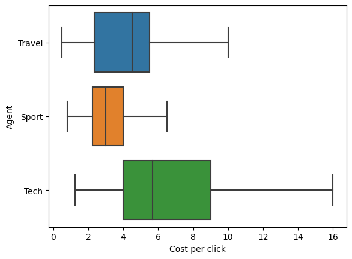

# Digital Ads Market Environment

In the digital ads world, publisher monetize their website real-estate by letting
advertisers display ads with the aim to attract more customers. We present here a
multi-agents environment simulating the bidding process performed between the
advertisers and happening in real-time to win the impressions offered by the publisher.

### Workflow

1. A user visits the website of the Publisher.
2. The Publisher sends an impression request to the AdExchange containing the unique
user identifier currently visiting the website.
3. The AdExchange acts as an intermediary between the Publisher and the Advertisers, it
forwards the request to all the Advertisers and exposes more detailed information about
the user.
4. The Advertisers collect this information and decide on the optimal bid to perform in
order to win the impression but also manage their budget.
5. The AdExchange gathers all the bids and select the winner of the auction via
different strategy (typically 1st price or 2nd price auction).
6. The AdExchange sends to the Publisher the ad of the winning Advertiser, and the
result of the auction to the Advertisers.
7. The ad is displayed to the user who will click on it with a certain probability, the
outcome of the display is fed back to the Advertiser to tweak its strategy.

### Objective

The main goal of the learning Advertiser is to find the best bidding strategy that will
help her maximizing the total number of clicks. In fact, different users may like
different things, and it might not be interesting to bid on the impressions for a user
who is not interested in the Advertiser's product. The learning agent should learn to
tweak its strategy using the information about the user and its remaining budget.

### Results

In the plot above, we observe how a Tech Advertiser with a fixed budget of 10 adapts its behavior when the budget allocated to its main competitor changes. We see that the agent shifts its strategy to focus on another user in order to maximizes its chances of winning clicks.

Here we analyse the distribution of the cost per click of all the 3 types of agents.

This plot demonstrates that the policy has learnt to increase the bid size as a function of the budget allocated.

### References

- Junqi Jin, Chengru Song, Han Li, Kun Gai, Jun Wang, and Weinan Zhang. 2018. Real-Time Bidding with Multi-Agent Reinforcement Learning in Display Advertising. In <i>Proceedings of the 27th ACM International Conference on Information and Knowledge Management</i> (<i>CIKM '18</i>). Association for Computing Machinery, New York, NY, USA, 2193–2201. DOI:https://doi.org/10.1145/3269206.3272021
- Han Cai, Kan Ren, Weinan Zhang, Kleanthis Malialis, Jun Wang, Yong Yu, and Defeng Guo. 2017. Real-Time Bidding by Reinforcement Learning in Display Advertising. In <i>Proceedings of the Tenth ACM International Conference on Web Search and Data Mining</i> (<i>WSDM '17</i>). Association for Computing Machinery, New York, NY, USA, 661–670. DOI:https://doi.org/10.1145/3018661.3018702
